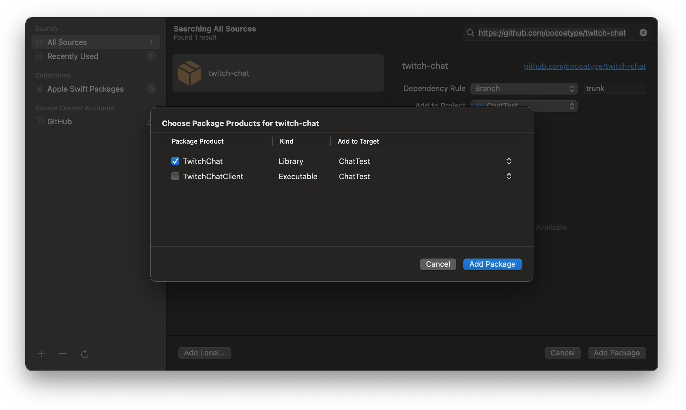

# TwitchChat

TwitchChat is a Swift library for consuming chat from Twitch streams.

## Installation

The only supported method of installation for TwitchChat is Apple’s Swift Package Manager. To add TwitchChat to an Xcode project, follow Apple’s [tutorial on adding package dependencies to your app](https://developer.apple.com/documentation/xcode/adding_package_dependencies_to_your_app). The URL to use for installation is the GitHub repo for TwitchChat: [https://github.com/cocoatype/twitch-chat](https://github.com/cocoatype/twitch-chat).

When adding TwitchChat as a package dependency, be sure to check only the TwitchChat library and not the TwitchChatClient example project:



If using TwitchChat as a sub-package of another package, you can add it to your `Package.swift` file’s `dependencies` like so:

```swift
dependencies: [
  .package(url: "https://github.com/cocoatype/twitch-chat", .exactItem("0.0.1"))
]
```

## Usage

To use TwitchChat, first create an instance of `TwitchChat` by passing in a [user access token](https://dev.twitch.tv/docs/irc/authenticate-bot) and the name of the channel whose chat you want to receive messages for:
```swift
let chat = TwitchChat(token: "my-user-token", name: "cocoatype")
```

After creating an instance of `TwitchChat`, you can receive messages by reading the asynchronous `messages` property:
```swift
for try await message in chat.messages {
  // display messages
}
```

### Messages

A message contains several properties: the sender, the sender’s preferred chat color, the text of the message, and an array of emotes included in the message.

The array of emotes included in each message includes a URL for downloading the image associated with the emote and a range of characters to replace when displaying the emote.

## Contributing

TwitchChat is not accepting code contributions at this time. Please feel free to file any issues and bug reports you may come across. 

## License

TwitchChat is licensed under the [MIT License](LICENSE).
